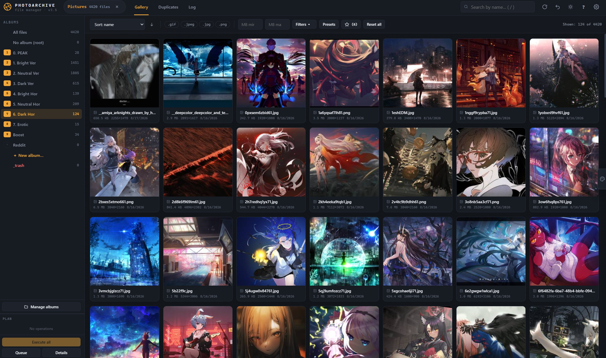

# Photo Archive — Gallery Manager

A local, browser-based gallery manager for organizing photo and video collections. It runs entirely in the browser via the **File System Access API** — no installation, no server, and your files never leave your computer.

Every destructive action (move, delete, rename) is first placed into a **queue** and only executed after explicit confirmation, with pause, resume, cancel, and undo support.

  
  
  
  
  
  

  

---

## Features

### Gallery
- Virtualized thumbnail grid that handles large collections smoothly.
- Thumbnails are generated on the fly and cached in **IndexedDB**.
- Sorting by name, date, size, or resolution (ascending/descending).
- Filter by file extension, size range (MB), and filename search.
- Separate handling for photos and videos (video duration and poster frame).

### Albums
- Albums map directly to **subfolders** of the opened directory.
- Create, rename, disable, and delete albums.
- Assign hotkeys `1–9` to albums for instant moves; `0` moves to root.
- Built-in `_trash` folder support: deleted files go to trash instead of being removed permanently (configurable).
- Delete an album while choosing to keep its photos (evacuate to another album or root) or delete them with it.

### Filters & Presets
- Advanced filters: media type, aspect ratio (including custom), brightness, and resolution (width/height).
- Computed filters (brightness, resolution) prompt you to calculate missing values on demand — partially or fully.
- Save any filter combination as a **preset**, pin presets for one-click access, reorder pins by drag & drop, and apply them additively or as a full replacement.

### Duplicate Search
- **Exact duplicates** — across photos and videos using **SHA-256** (with a pure-JS fallback), pre-filtered by file size.
- **Similar duplicates** — images only, with five selectable algorithms:
  - `dHash` — gradient-based
  - `aHash` — average-based
  - `pHash` — DCT, robust to cropping and color correction
  - `Color histogram` — HSV intersection, ignores geometry
  - `Feature points` — robust to rotation and scale
- Adjustable similarity threshold and signature size / point count.
- Per-group suggestions: keep largest, keep best resolution, or keep earliest.
- Signatures are cached so repeated scans are fast.
- Side-by-side **compare mode** in the viewer with synchronized zoom.

### Palette Search
- Find photos by color composition.
- Query **from a sample photo** (click any tile) or **manually** by defining up to 8 colors with weight shares.
- Optional brightness matching; adjustable similarity threshold.
- Results are sorted by similarity and the match percentage is shown on each tile.
- Save successful queries as reusable palette presets.
- Slide-out panel, optionally opened by hovering the right screen edge, with a "pin" mode.

### Queue-First Operations
- All file changes (move, delete, rename, album operations) are queued first.
- A plan panel groups operations by type and target.
- Execute all or per-section, with **pause**, **resume**, **cancel-all**, and per-operation cancel while running.
- Multi-step **undo** (`Ctrl+Z`).
- An **operation log** records each run with status, per-file results, and previous state (e.g., original album or filename), letting you locate files in the gallery.

### Viewer (Lightbox)
- Keyboard navigation, zoom at cursor position with the mouse wheel, pan when zoomed, double-click to zoom/reset.
- Inline rename, quick delete, quick move to any album.
- Comparison mode for duplicate groups.

### Localization
- Ships with **English** and **Russian** (including full pluralization via `Intl.PluralRules`).
- Import additional translations from a JSON file, or export a template to create your own.

### Themes
- Dark and light themes, toggleable and persisted.

---

## Quick Start

1. Save the file as `index.html`.
2. Open it in **Chrome** or **Edge** — double-click is enough; no build step or server required.
   - Optionally serve it with any static server, e.g. `npx serve .`
3. Click **Choose folder** and grant read/write access to your photo directory.

> If your browser doesn't support the File System Access API, you can still use **View-only mode** to browse a folder without making changes.

---

## Browser Support

| Capability | Requirement |
|---|---|
| Full read/write mode | Chrome or Edge (File System Access API) |
| View-only mode | Any modern browser (via folder input) |

---

## Architecture

The entire application is a **single self-contained HTML file** with no external dependencies or network requests.

- **File System Access API** — read/write access to the chosen directory.
- **IndexedDB** — caches for thumbnails, image dimensions, brightness values, and duplicate/palette signatures.
- **Web Worker** — offloads heavy computation: SHA-256 hashing, perceptual signatures, pair matching, and palette ranking.
- **localStorage** — user settings, operation log, filter presets, pinned presets, and saved palettes.
- **OffscreenCanvas / createImageBitmap** — fast image decoding and thumbnail generation.

---

## Keyboard Shortcuts

### Gallery

| Keys | Action |
|---|---|
| `Ctrl + A` | Select all visible files |
| `Shift + Click` | Range selection |
| `Delete` | Queue selected files for deletion |
| `M` | Toggle palette panel |
| `1` – `9` | Move selection to the corresponding album |
| `0` | Move selection to root |
| `R` | Refresh gallery from disk |
| `/` | Focus search |
| `Ctrl + Z` | Undo last queue step |
| `Esc` | Clear selection / close panels |

### Viewer

| Keys | Action |
|---|---|
| `←` / `→` | Previous / next file |
| `Delete` or `↑` | Delete current file (to queue) |
| `1` – `9` / `0` | Quick move to album / root |
| Mouse wheel | Zoom at cursor |
| `+` / `−` | Zoom from center |
| Double-click | Zoom / reset zoom |
| Click filename | Rename (`Enter` queues, `Esc` cancels) |
| `Esc` | Close viewer |

### Duplicates

| Keys | Action |
|---|---|
| `←` / `→` | Files within a group |
| `↑` / `↓` | Switch groups |
| `C` | Toggle compare mode |
| `Esc` | Close viewer |

---

## Data & Privacy

- All processing happens locally in your browser. Nothing is uploaded anywhere.
- File modifications only occur after you confirm execution of the queued plan.
- Caches (thumbnails, signatures, brightness, dimensions) speed up repeated work and can be cleared at any time from **Settings → Data**.
- Settings, logs, and presets can be exported/imported as JSON.

---

## Settings Overview

| Section | Options |
|---|---|
| **View** | Language, theme, thumbnail size, default sorting, palette hover behavior |
| **Operations** | Trash on/off, auto-advance in viewer, move method (native move vs. copy + delete), parallelism (batch size) |
| **Duplicates** | Default algorithm and similarity threshold |
| **Data** | Log entry limit, export/import settings, clear thumbnail / brightness / signature caches, full reset |

---

## Limitations

- Full write access requires a Chromium-based browser (Chrome / Edge).
- The File System Access API works over secure contexts; features degrade gracefully to view-only elsewhere.
- Video similarity is limited to exact (hash) matching; similar-search algorithms apply to images only.

---

## License

Distributed as-is for personal and internal use.
